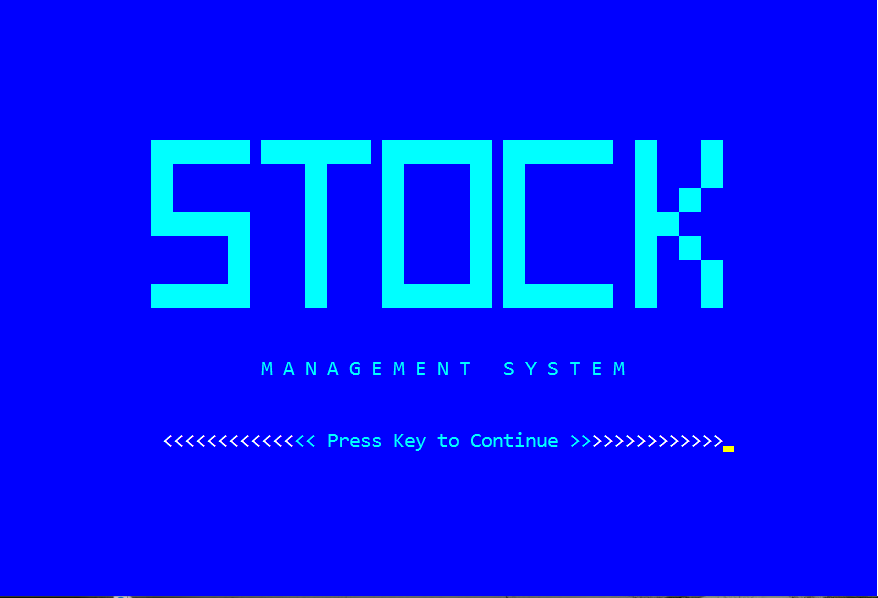
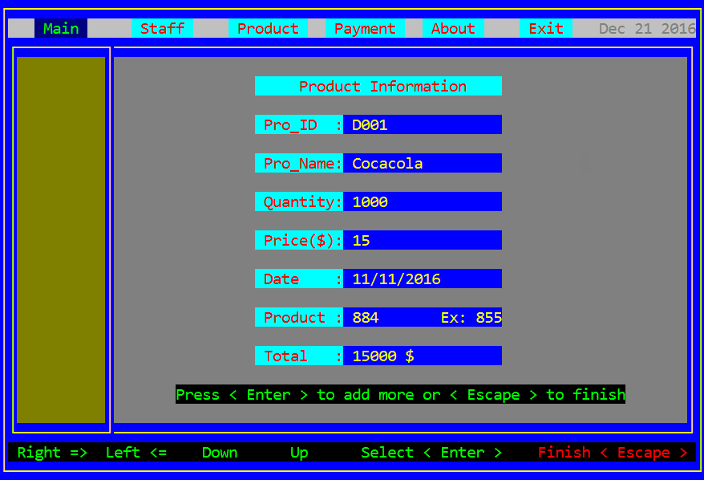
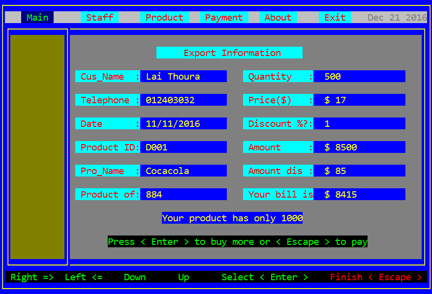

# Stock Management System

This is a project that I have implemented when I accomplished the C/C++ course at ANT Training Center since **2016**. 

# Installation
- IDE: **Dev-C++**
- Build it as ***.exe** file for windows, then we can run it.

# Login as Default Admin
- username: **admin**   
- password: **1234**

**Staff:**

**Product:**

**Export:**

