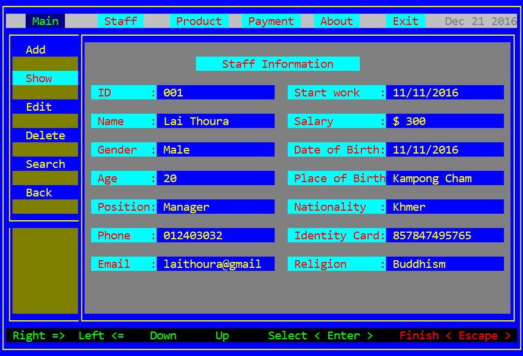

# Stock Management System

This is a project that I have implemented when I accomplished the C/C++ course at ANT Training Center since **2016**. 

> Note: I didn't follow the proper **naming convention**, nor **OOP** concept. > Hopefully, it is helpful for a newbie who just start learning C/C++.

# Installation
- IDE: **Dev-C++**
- Build it as ***.exe** file for windows, then we can run it.

# Login as Default Admin
- username: **admin**   
- password: **1234**

Then, enjoy testing it (:

**Staff:**

**Product:**

**Export:**

